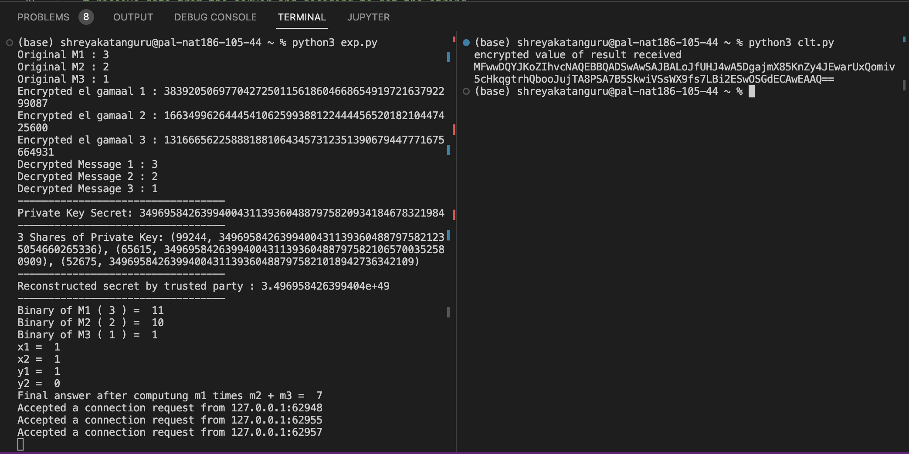

# 555-Project
HOW TO: 
1. Run encrypt.py using $ python3 encrypt.py
2. Run clientForProject.py using $ python3 clientForProject.py
The ouput would look like

3. Create a python environment using $ python -m venv venv
4. $ source venv/bin/activate
5. Start the sandbox using $ ./sandbox up
6. Build the code using $ ./build.sh contracts.rps.step_01
7. Enter the algorand sandbox using $ ./sandbox enter algod
8. Get the account address to create the app using # goal account list
9. Create the app using # goal app create --creator <account_address> --approval-prog /data/build/approval.teal --clear-prog /data/build/clear.teal --global-byteslices 1 --global-ints 3 --local-ints 0 --local-byteslices 0

